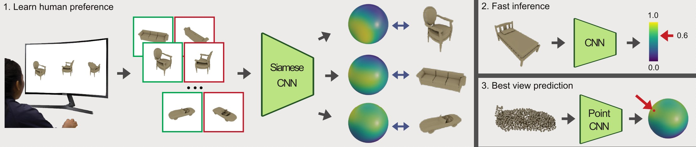

# Learning Human Viewpoint Preferences from Sparsely Annotated Models
We provide the first deep learning approach to learn the human viewpoint preference directly from annotated data. Moreover, we provide several designs to compute such metrics in a few milliseconds enabling its use in real-time applications.


See our [video](https://cloudstore.uni-ulm.de/s/PKx3doHdbpWZWc6).

## Update
  - 8th June 2022: Added links to our dataset and supplementary material.
  - 10th January 2023: Added train and test code.

## Dataset
  - We generated our dataset based on 3D models taken from [ModelNet40](http://modelnet.cs.princeton.edu/ModelNet40.zip).
  - Images and human annotations are available [here](https://cloudstore.uni-ulm.de/s/Zek4pNR9SBcjtaf/download/modelnet28.zip).

## Supplementary Material
Your can download our supplementary material [here](https://cloudstore.uni-ulm.de/s/tRJMJJpdRKx78gX/download/supplementary_material.pdf).

## Training
- In order to train the model from scratch download the modelnet28.zip file and extract it and run the command below.
```console
python train.py --dataset_path /path/to/modelnet28 --max_epochs 200
```

## Testing
- You can download the model weights for the model trained on the UNFILTERED dataset here. [unfiltered.ckpt](https://cloudstore.uni-ulm.de/s/ixQqiFAC6AMoEKR/download/unfiltered.ckpt).
- You can download the model weights for the model trained on the FILTERED dataset here. [filtered.ckpt](https://cloudstore.uni-ulm.de/s/ogjNTeKQdgBMy62/download/filtered.ckpt).
- Evaluate the models using the code below.
```console
python test.py --dataset_path /path/to/modelnet28 --ckpt unfiltered.ckpt
python test.py --dataset_path /path/to/modelnet28 --ckpt filtered.ckpt
```

