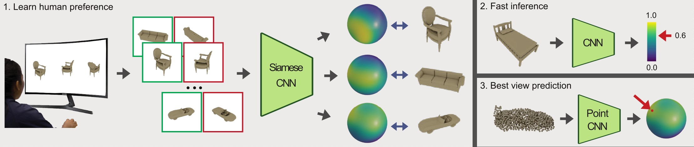

# Learning Human Viewpoint Preferences from Sparsely Annotated Models

We provide the first deep learning approach to learn the human viewpoint preference directly from annotated data. Moreover, we provide several designs to compute such metrics in a few milliseconds enabling its use in real-time applications.



See our [video](https://cloudstore.uni-ulm.de/s/PKx3doHdbpWZWc6).

## Updates
- 8th June 2022: Added links to our dataset and supplementary material.
- 10th January 2023: Added train and test code.
- March 2026: Dataset published on [HuggingFace](https://huggingface.co/datasets/kopetri/human_viewpoint_preferences); codebase migrated to Lightning CLI.

## Dataset

The dataset is based on 3D models from [ModelNet40](http://modelnet.cs.princeton.edu/ModelNet40.zip) and is automatically downloaded from HuggingFace during training — no manual setup required.

- HuggingFace: [kopetri/human_viewpoint_preferences](https://huggingface.co/datasets/kopetri/human_viewpoint_preferences)

## Supplementary Material

You can download our supplementary material [here](https://cloudstore.uni-ulm.de/s/tRJMJJpdRKx78gX/download/supplementary_material.pdf).

## Setup

**Option A — uv (recommended):**

```console
pip install uv
uv sync
```

Then prefix every command below with `uv run` (handles the virtualenv automatically).

**Option B — plain pip:**

```console
python -m venv .venv
source .venv/bin/activate          # Windows: .venv\Scripts\activate
pip install .
```

Then replace `uv run` with `python` in every command in this README.

---

## Training

All training is driven by `run.py` using [LightningCLI](https://lightning.ai/docs/pytorch/stable/cli/lightning_cli.html). Configs for both tasks are in `configs/`.

### Score model — predict a continuous viewpoint quality score

```console
uv run run.py fit --config configs/score.yaml
```

### Ranking model — learn pairwise viewpoint preference

```console
uv run run.py fit --config configs/ranking.yaml
```

Override any config value on the command line, e.g.:

```console
uv run run.py fit --config configs/score.yaml \
    --trainer.max_epochs 100 \
    --trainer.accelerator gpu \
    --data.init_args.batch_size 32
```

Checkpoints and metrics are saved to `lightning_logs/version_<N>/`.

---

## Evaluation

Use the `test` subcommand with the same config and a checkpoint:

### Score model

```console
uv run run.py test --config configs/score.yaml \
    --ckpt_path model.ckpt
```

### Ranking model

```console
uv run run.py test --config configs/ranking.yaml \
    --ckpt_path model.ckpt
```

---

## Inference

`infer.py` loads a checkpoint directly and runs on individual images — no training infrastructure needed.

### Score — predict the viewpoint quality of one or more images

```console
uv run infer.py score \
    --ckpt model.ckpt \
    --image view_a.png view_b.png
```

Output:

```
view_a.png    score = 0.7312
view_b.png    score = 0.2891
```

### Rank — compare two images and predict which viewpoint is preferred

```console
uv run infer.py rank \
    --ckpt model.ckpt \
    --image0 view_a.png \
    --image1 view_b.png
```

Output:

```
image0    : view_a.png
image1    : view_b.png
preferred : view_a.png  (margin = 0.4624, p(image0) = 0.7312)
```

## Checkpoints
| Task | Checkpoint |
| :--- | :--- |
| **Ranking** | rank_model.ckpt |
| **Scoring** | [score_model.ckpt](https://huggingface.co/datasets/kopetri/human_viewpoint_preferences/resolve/main/score_model.ckpt) |